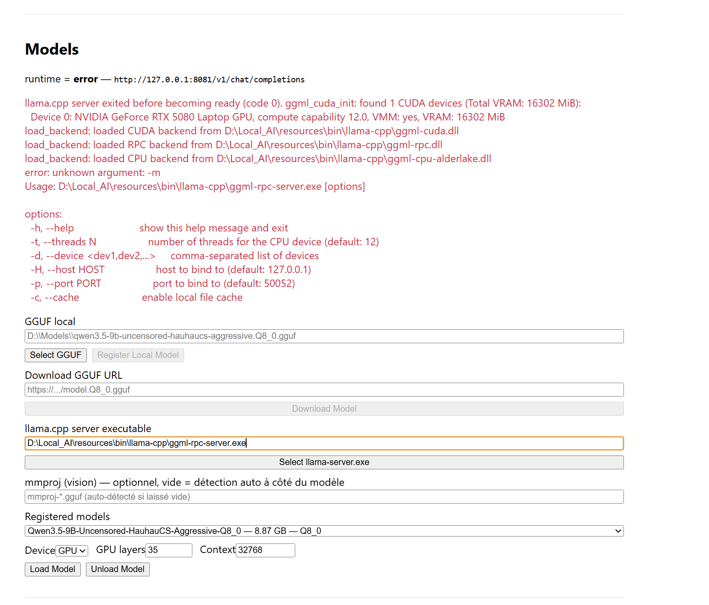

# graphify
- **graphify** (`.claude/skills/graphify/SKILL.md`) - any input to knowledge graph. Trigger: `/graphify`
When the user types `/graphify`, invoke the Skill tool with `skill: "graphify"` before doing anything else.
